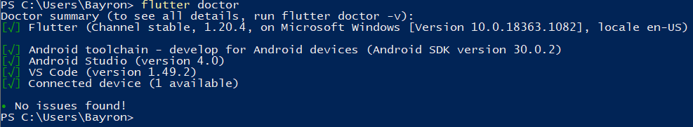
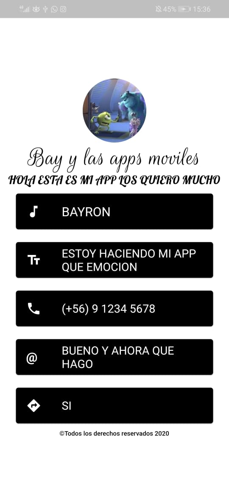

# Tarjeta de presentación

Tarea para IWG-101 de Desarrollo Móvil

La tarea la hice utilizando un dispositivo móvil físico.

## Evidencias

Las evidencias pueden ser encontradas en la carpeta "evidences", la cual contiene los siguientes datos:

* Correcta instalación del entorno de desarrollo para fluter, mediante `flutter doctor`.

    

* Correcta ejecución del [programa base](https://github.com/chihau/tarea_iwg101) (tarjeta presentación de Chihau Chau), y posterior modificación.

  
  
